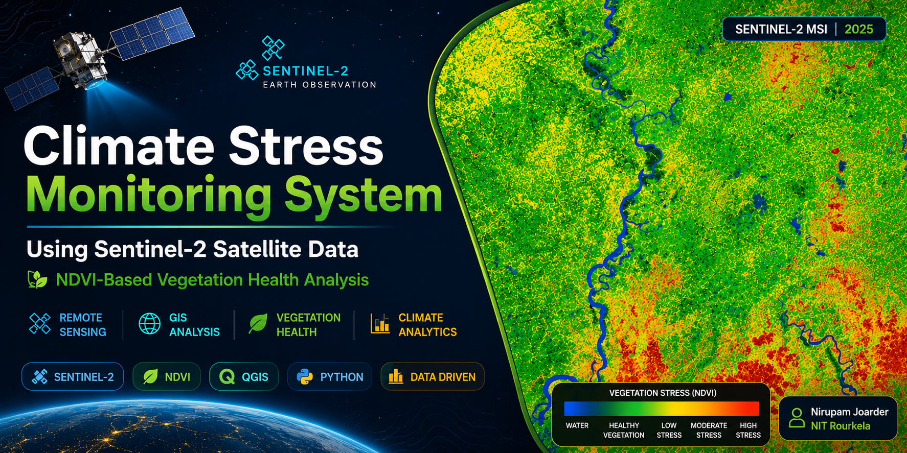
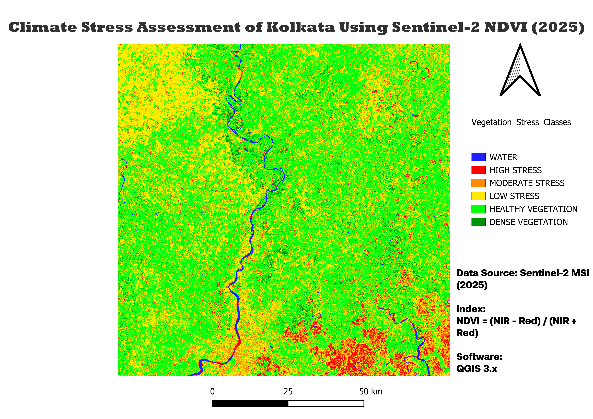

<p align="center">
  
</p>

# 🌍 Climate Stress Monitoring System Using Sentinel-2 Satellite Data


## 📌 Project Overview 

This project presents a satellite-based climate stress monitoring system developed using Sentinel-2 multispectral imagery and GIS analysis techniques. The objective is to assess vegetation health and identify climate stress zones across the Kolkata region using the Normalized Difference Vegetation Index (NDVI).

By leveraging remote sensing data, the project enables rapid identification of healthy vegetation, moderate stress regions, and high-stress zones that may require environmental monitoring or intervention.

---

## 🎯 Objectives

- Acquire Sentinel-2 satellite imagery
- Calculate NDVI from Red and Near-Infrared bands
- Assess vegetation health across Kolkata
- Identify climate stress hotspots
- Generate classified GIS maps
- Visualize vegetation stress patterns for environmental monitoring

---

## 🛰️ Data Source

**Satellite:** Sentinel-2 MSI

**Year:** 2025

**Spatial Resolution:** 10 m

**Study Area:** Kolkata, India

---

## 🧠 Methodology

### Step 1: Satellite Data Acquisition

Sentinel-2 multispectral imagery was obtained for the Kolkata region.

### Step 2: NDVI Computation

NDVI was calculated using:

```text
NDVI = (NIR - Red) / (NIR + Red)
```

Where:

- NIR = Near Infrared Band
- Red = Red Band

### Step 3: Climate Stress Classification

NDVI values were classified into vegetation stress categories:

| NDVI Range | Category |
|------------|-----------|
| < -0.16 | Water Bodies |
| -0.16 – 0.00 | High Stress |
| 0.00 – 0.11 | Moderate Stress |
| 0.11 – 0.39 | Low Stress |
| 0.39 – 0.67 | Healthy Vegetation |
| > 0.67 | Dense Vegetation |

### Step 4: GIS Visualization

The classified raster was visualized in QGIS and exported as a thematic climate stress map.

---

## 📊 Results

<p align="center">
  
</p>

### Interpretation

- 🔵 Blue regions represent water bodies.
- 🔴 Red regions indicate high vegetation stress.
- 🟠 Orange regions indicate moderate stress.
- 🟡 Yellow regions indicate low stress.
- 🟢 Green regions represent healthy vegetation.
- 🟩 Dark green regions indicate dense vegetation cover.

---

## 📈 Raster Statistics

| Metric | Value |
|----------|----------|
| Minimum NDVI | -1.000 |
| Maximum NDVI | 1.000 |
| Mean NDVI | 0.390 |
| Standard Deviation | 0.185 |
| Total Pixels | 120,560,400 |

---

## 🛠️ Tools & Technologies

- Python
- Jupyter Notebook
- QGIS 3.44
- Sentinel-2 MSI
- GDAL
- Raster Processing
- Remote Sensing
- GIS Analysis

---

## 📂 Repository Structure

```text
Climate-Stress-Assessment-Sentinel2/
│
├── assets/
│   ├── banner.png
│   └── map_output.png
│
├── data/
│   ├── Kolkata_NDVI_2025.tif
│   └── Kolkata_NDVI_2025.tif.aux.xml
│
├── maps/
│   ├── Kolkata_Climate_Stress_Map_2025.pdf
│   └── Kolkata_Climate_Stress_Map_2025.png
│
├── notebooks/
│   └── climate_stress.ipynb
│
├── qgis/
│   └── Climate_Stress_Project.qgz
│
├── README.md
├── requirements.txt
└── .gitignore
```

---

## 🌎 Applications

- Environmental Monitoring
- Urban Green Cover Assessment
- Climate Stress Detection
- Vegetation Health Monitoring
- Remote Sensing Analytics
- GIS-Based Decision Support

---

## 🚀 Future Improvements

- Multi-year NDVI trend analysis
- Climate anomaly detection
- Interactive geospatial dashboard
- Web GIS deployment
- Automated satellite data pipeline
- Machine learning-based vegetation forecasting

---

## 👨‍💻 Author

**Nirupam Joarder**

B.Tech Biotechnology  
National Institute of Technology Rourkela

---

## ⭐ Acknowledgements

- European Space Agency (ESA)
- Sentinel-2 Mission
- QGIS Community
- Open-Source Geospatial Ecosystem
